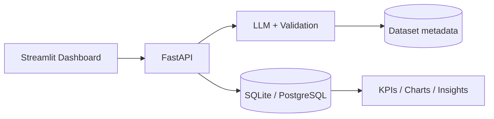

# Sales KPI API

Hey, this is a project I built to help small businesses upload messy datasets, understand what the columns mean, validate the file quality, and turn the data into useful sales and inventory KPIs.

I made it because real business files usually do not come with perfect column names. One spreadsheet might say `Sales_Volume`, another might say `Unit_Price`, `Qty`, `Stock_On_Hand`, or `SKU`. My goal was to make the app smart enough to separate sales from inventory, avoid bad mappings, and only show the metrics that actually exist in the file.

## What I built

- A FastAPI backend for dataset analysis and KPI generation
- A Streamlit dashboard for uploading files and exploring the results
- LLM-based column mapping with normalization rules for business datasets
- Data validation for empty columns, invalid numbers, and corrupt files
- Inventory-aware KPIs and charts alongside sales analytics
- Persisted metadata so each dataset remembers what was detected

## Portfolio story

I built this project to solve a real business problem: messy spreadsheets should not stop a small business from understanding its sales and inventory data.

The main things I wanted to show here are:

- how I designed safer LLM-based field mapping
- how I separated analysis logic into reusable services and routers
- how I made the dashboard adapt to different dataset types
- how I handled bad files with clear, user-friendly messages
- how I packaged the project so someone else can try it quickly

## Stack

- FastAPI
- Streamlit
- Pandas
- SQLAlchemy
- Ollama for local LLM analysis
- SQLite by default for easy local testing

## Architecture



## What the app does

1. I upload a CSV or Excel file.
2. The API checks for empty columns, invalid numbers, and corrupted files.
3. The LLM proposes a normalized `column_mapping`.
4. The app detects the available KPIs and charts.
5. The dashboard renders only the metrics that make sense for that dataset.

## Features

- Sales and inventory column detection
- Safer mapping for fields like `Sales_Volume` and `Unit_Price`
- Inventory metrics like `total_stock`, `inventory_value`, and `stock_by_category`
- Charts for stock by category, location, supplier, and top products
- Clear error states when the dataset needs review
- Stored analysis metadata for every upload

## Public testing

I made the project easier to test from GitHub by defaulting the database to SQLite, so anyone can clone the repo and run it locally without setting up PostgreSQL first.

For the full analysis experience, Ollama still needs to be running locally.

### Requirements

- Python 3.10+
- Ollama installed and running
- Optional: PostgreSQL if I want to override the default SQLite database

### Quick start

```bash
git clone https://github.com/<your-user>/sales-kpi-api.git
cd sales-kpi-api
python -m venv .venv
.venv\Scripts\activate
pip install -r requirements.txt
```

### Run Ollama

```bash
ollama serve
ollama pull qwen2.5:14b
```

### Run the API

```bash
uvicorn app.main:app --reload
```

### Run the dashboard

```bash
streamlit run dashboard.py
```

### Run with Docker Compose

```bash
docker compose up --build
```

Then open:

- API: http://localhost:8000
- Dashboard: http://localhost:8501

This is the easiest way for other people to test the project from GitHub because it starts both services with one command.

### What reviewers should check

If someone is reviewing this as a portfolio project, I want them to try these things:

1. Open the dashboard and upload `data/test_sales.csv`.
2. Confirm the app detects sales KPIs and renders charts.
3. Upload an inventory-style file and confirm the inventory KPIs appear.
4. Try a broken or empty file and confirm the validation message is clear.
5. Check that the README and Docker Compose flow are enough to run the project without guessing.

### Test with sample data

1. Open the dashboard in the browser.
2. Upload `data/test_sales.csv` or another CSV/Excel file.
3. Review the detected KPIs, charts, and validation summary.
4. Check that the app stores the metadata for the dataset.

### Run the tests

```bash
python -m unittest test_llm_mapping.py
```

## API endpoints

- `POST /analyze-dataset`
- `POST /upload-dataset`
- `POST /upload-sales`
- `GET /datasets`
- `GET /datasets/{dataset_id}/dashboard`
- `GET /datasets/{dataset_id}/kpis`
- `GET /datasets/{dataset_id}/insights`
- `GET /kpi/revenue`
- `GET /kpi/top-products`

## Persisted metadata

Each dataset stores:

- `column_mapping`
- `detected_fields`
- `available_kpis`
- `available_charts`
- `validation_summary`

## Error messages

When the file is not reliable enough to analyze, I show clear messages like:

- `No pude detectar KPIs`
- `El archivo no parece tener columnas numéricas`
- `Este dataset necesita revisión`

## Project structure

- `app/routes/` for API endpoints
- `app/services/` for shared analysis logic
- `app/models.py` for persistence
- `dashboard.py` for the Streamlit UI

## Screenshots

I recommend adding a `docs/screenshots/` folder with images of:

- the upload flow
- the sales dashboard
- the inventory dashboard
- the validation states

For the final portfolio version, I would place screenshots next to these names:

- `docs/screenshots/upload.png`
- `docs/screenshots/sales-dashboard.png`
- `docs/screenshots/inventory-dashboard.png`
- `docs/screenshots/validation-state.png`

## Notes

If I want to use PostgreSQL instead of SQLite, I can set `DATABASE_URL` before starting the app.

If I run the dashboard outside Docker, it uses `http://127.0.0.1:8000` by default. Inside Docker Compose, it points to the API service automatically.
